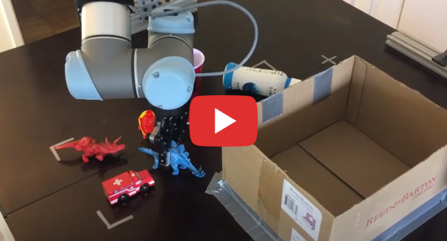
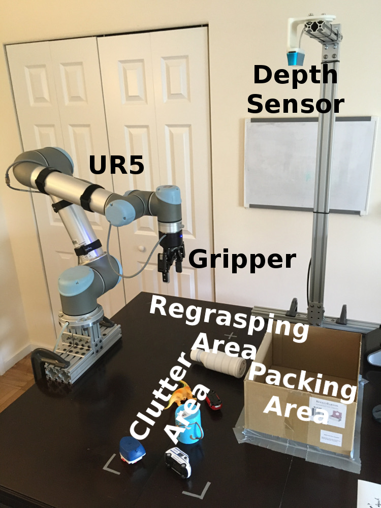
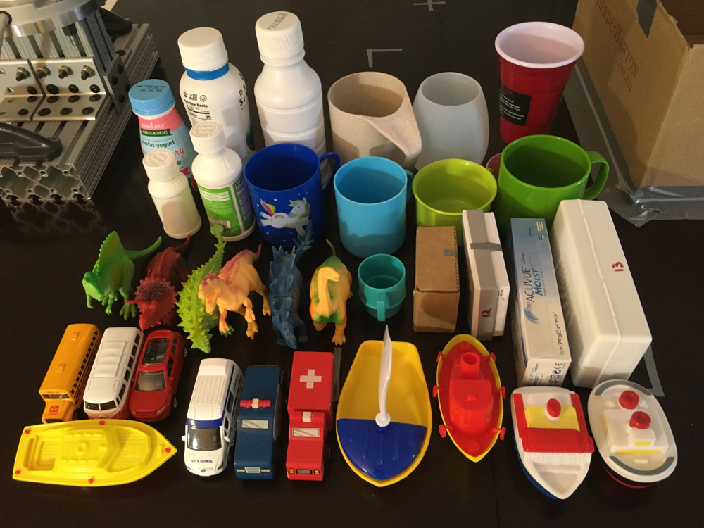

# GeomPickPlace

Code for reproducing experiments for the paper "Pick-and-Place With Uncertain Object Instance Segmentation and Shape Completion": https://arxiv.org/abs/2010.07892.

* **Authors:** Marcus Gualteri
* **Version:** 1.0.0

## Prerequisites

Tensorflow 2.1.0 (https://www.tensorflow.org/install), PointCloudsPython (https://github.com/mgualti/PointCloudsPython), and OpenRAVE (https://github.com/rdiankov/openrave) are required. These instructions for installing OpenRAVE were helpful: https://scaron.info/teaching/installing-openrave-on-ubuntu-16.04.html. PointCloudsPython requires PCL, and we used the version that comes with ROS Kinetic. Matlab is used for plotting results, but this is not a strict requirement. The code was tested on Ubuntu 16.04.

It is also recommended to run Simulation/extensions/build.sh, which requires a C++ compiler.

## Dataset generation

First, download and extract 3DNet Cat200 Model Database (https://strands.readthedocs.io/en/latest/datasets/three_d_net.html). Download ShapeNETCore V2 for the bottle arrangement task, since it has more bottles than 3DNet (https://www.shapenet.org/). Use the scripts view_meshes_3dnet.py, view_meshes_shapenet.py, and extract_meshes_shapenet.py to extract and examine the meshes. Partition the meshes into train and test sets as indicated by the file names in the text files under Data/. (It is recommended to write a Python script for this: load each text file's contents as a list, and then check the model file names against the list to determine under which folder the model file should be stored.) The mesh files should be organized according to the structure of the Data/ directory, where each text file represents a folder by the same name.

After this, run python/generate\_full\_clouds_\*.py from the Simulation directory. Then, run generate\_completions\_\*.py, generate_segmentations\_\*.py, generate_grasps\_\*.py, and generate_places\_\*.py. This latter step takes a lot of time and space, but it can be skipped if using the pretrained network models from Simulation/tensorflow/models.

## Training

Use train\_segmentations.py, train\_completions.py, train\_grasp\_prediction.py, and train\_place\_prediction.py to train the network models. They should be run once for each task. (The latter two are only needed for the SP method. This step can be skipped if using pretrained network models from Simulation/tensorflow/models.)

## Testing

Set parameters in the place\_\*\_params.py file. For perception ablation studies, use taskCostFactor = 1 and regraspPlanStepCost = 1. For "No Cost", set all cost factors to 0. For "Step Cost", set regraspPlanStepCost = 1. For GQ, set antipodalCostFactor = 1. For CU, set segmUncertCostFactor = 1, compUncertCostFactor = 1, graspUncertCostFactor = 1, and placeUncertCostFactor = 1. For MC and SP methods, use files with the \_mc and \_sp suffix..

Next, from the Simulation directory, open N terminals and run python/worker\_\*.py i for i = 0, ..., N-1. These are worker processes for the arrangement and regrasp planners. For packing, N = 8, for canonical, N = 6, for bottles, N = 2, and for blocks, N = 5.

Then, from the Simulation directory, edit python/place\_\*.py, and set showViewer = True and showSteps = True. This will visualize the simulation, which is important for the first time running it. Then, run python/place\_\*.py. If everything is satisfactory, set showViewer = False and showSteps = False and run the scenario. A mat file will be produced with the results. See the matlab folder for scripts for processing the results.

## Running on a Real Robot

The Robot/ folder is a ROS node for running this on a UR5. This depends on the UR ROS driver (https://github.com/UniversalRobots/Universal_Robots_ROS_Driver). Use this experimental code with caution as it has been tested with only one robot arm. Start with low speeds and low acceleration (/Robot/scripts/robot/arm.py). Much of the code has been adapted from the Simulation folder. Copy Simulation/tensorflow/models to Robot/tensorflow/models. (Except, for bottles, set addSensorNoise=True in generate_segmentations_bottles.py and retrain BoNet with simulated sensor noise. For blocks, use the BoNet model trained for packing.)

Our experimental results, along with Amazon links for most test objects, are in the /Robot/notes folder.

## Review

Check python/geom_pick_place/planner_regrasp.py for how the regrasp planner works. (It is pretty well documented.) This class is inherited by SP and MC regrasp planners. Check environment\_\*.py for how the grasp and placement conditions are evaluated. Open a new issue if any difficulties are encountered reproducing the results.
